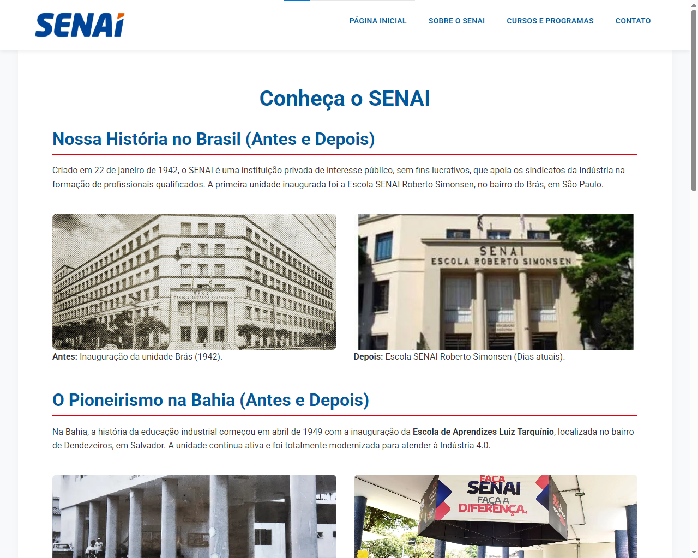
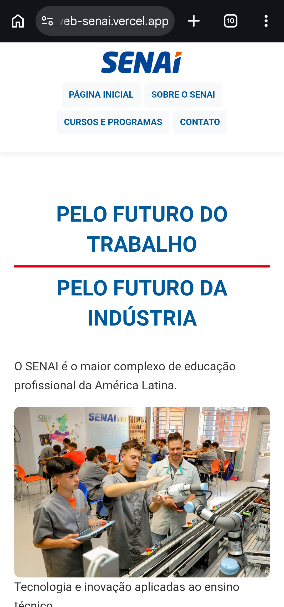

# 🌐 Site Institucional - SENAI

**🔗 Acesse o projeto online:** [https://ufrb-projeto-web-senai.vercel.app/]

Este é um projeto Front-End de um site institucional desenvolvido com a identidade visual do **Serviço Nacional de Aprendizagem Industrial (SENAI)**. O foco do projeto é a utilização de HTML5 semântico e CSS3 puro, com forte ênfase em **responsividade** e **acessibilidade**.

---

## 📌 Terceiro Envio: Estilização e Responsividade (CSS)

Principais alterações e implementações visuais realizadas no projeto:

* **Estilização com Vanilla CSS:** Criação do arquivo `style.css` e vinculação a todas as páginas HTML, utilizando CSS puro e semântico sem dependência de frameworks externos.
* **Identidade Visual e Tipografia:** Implementação de variáveis CSS (`:root`) para a paleta de cores oficial do SENAI e importação da fonte *Roboto* através do Google Fonts.
* **Layout Moderno (Flexbox e Grid):** Utilização de Flexbox para estruturar o cabeçalho e menu de navegação, e implementação de CSS Grid automatizado para exibir os "Cards" de cursos (com a adição de um 6º curso, Mecatrônica, para garantir a simetria perfeita do layout).
* **Padronização de Imagens:** Aplicação da propriedade `object-fit: cover` para garantir que todas as imagens dos cards mantenham um tamanho uniforme e profissional, sem distorcer.
* **Aprimoramento de Tabelas e Formulários:** Aplicação de efeito "zebrado" (`nth-child`) na tabela de cursos para melhorar a leitura. O formulário de contato recebeu estilização completa com feedback visual de validação nativa (`:user-invalid`), efeitos de foco (`:focus`) e botões interativos (`:hover`).
* **Design Responsivo (Adaptativo):** Criação de *Media Queries* (Breakpoints em 1023px e 767px) para garantir o funcionamento perfeito em smartphones e tablets. O menu adapta-se para um formato compacto, as colunas empilham-se automaticamente e a tabela ganha *scroll* horizontal em telas pequenas.

---

## 📸 Screenshots

> **Nota:** Imagens representativas da versão final estilizada.

### Versão Desktop


### Versão Mobile (Celular)


---

## ✨ Funcionalidades e Destaques

* **Design Responsivo:** O layout se adapta perfeitamente a computadores, tablets e smartphones usando *Media Queries* e Flexbox/Grid.
* **Componentes Interativos Especiais:** Cards com efeito suave de flutuação e sombra ao passar o mouse (`:hover`), formulários com validação visual de erro em tempo real e tabelas com rolagem horizontal independente para evitar quebra de layout no celular.
* **Cabeçalho Otimizado:** Menu que permanece no topo (sticky) no desktop, mas flui com a página e se agrupa de forma compacta no mobile para economizar espaço de tela.
* **Identidade Visual Fiel:** Uso de variáveis CSS (`:root`) para padronizar as cores institucionais (Azul e Vermelho SENAI) e tipografia oficial (Roboto).
* **Estrutura Semântica:** HTML5 estruturado corretamente com `<header>`, `<nav>`, `<main>`, `<section>`, `<article>`, e `<footer>` para melhor SEO e acessibilidade.

---

## 🛠️ Tecnologias Utilizadas

* **HTML5:** Estrutura e semântica.
* **CSS3:** Estilização, variáveis globais, Flexbox, CSS Grid e Media Queries.
* **Google Fonts:** Tipografia *Roboto*.

---

## 📁 Estrutura do Projeto

O projeto é composto por múltiplas páginas interligadas:

```text
📁 projeto-senai
 ├── 📄 index.html       # Página inicial com destaques e slogan
 ├── 📄 sobre.html       # Informações sobre a instituição
 ├── 📄 cursos.html      # Lista de cursos e grades (Tabelas)
 ├── 📄 contato.html     # Formulário de contato
 ├── 📁 CSS
 │    └── 📄 style.css   # Folha de estilos unificada
 └── 📁 images           # Imagens e logotipo
